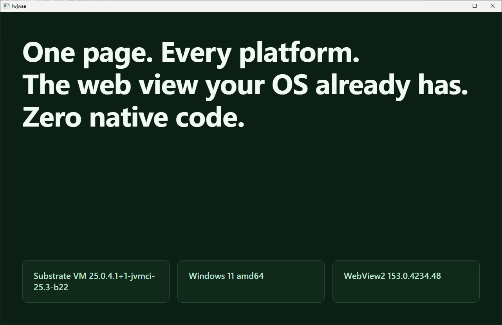

<h1 align="center">lwjwae</h1>

<p align="center">
  <b>Lightweight Java web application engine</b><br/>
  <i>No JNI. No native code. No native artifacts.</i>
</p>

<p align="center">
  <a href="https://github.com/fakeivchenko/lwjwae/actions/workflows/tests.yml"></a>
  <a href="https://github.com/fakeivchenko/lwjwae/actions/workflows/release.yml"></a>
  <a href="https://repo.ivchenko.dev/#/releases/dev/ivchenko/lwjwae/lwjwae-core"></a>
  
  
  <a href="LICENSE"></a>
</p>

Native desktop applications with a web view inside, from Java, through the Foreign Function and Memory
API. No JNI, no native artifacts of the library's own: on each platform, the window and the engine
are the ones that the operating system already has.

| Platform | Window | Engine        | Module                             | JAR                 | Native Image        |
|----------|--------|---------------|------------------------------------|---------------------|---------------------|
| Linux    | GTK 3  | WebKitGTK 4.1 | [`lwjwae-gtk`](lwjwae-gtk)         | <center>✅</center> | <center>✅</center> |
| Windows  | Win32  | WebView2      | [`lwjwae-windows`](lwjwae-windows) | <center>✅</center> | <center>✅</center> |
| macOS    | Cocoa  | WKWebView     | [`lwjwae-macos`](lwjwae-macos)     | <center>✅</center> | <center>✅</center> |

You write the interface in HTML, CSS, and JavaScript, ship it inside the native executable or JAR-package,
and call Java from the page and the page from Java through one bridge that works the same on every engine.



The window above is native compiled application created using lwjwae, compiled with
GraalVM to one executable and captured on Windows 11.

## A first window

```java
try (ApplicationBackend application = Application.create(ApplicationParameters.builder()
    .title("Docs")
    .width(1280)
    .height(800)
    .build())) {
  application.bind("reverse", text -> new StringBuilder(text).reverse().toString());
  application.loadResource("app/index.html");
  application.run();
}
```

On the page:

```js
const reversed = await window.reverse("lwjwae");
await window.lwjwae.listen("tick", (event) => console.log(event.payload));
```

`Application.create` picks the backend for the machine it runs on. Put
[`lwjwae-core`](lwjwae-core) and the backend module of your platform on the classpath, or all
three, and the same JAR file runs everywhere. [`lwjwae-examples`](../lwjwae-examples) has a demo
that shows every feature on one page.

## Requirements

- **Java 25** or newer. The library binds native code through the FFM API and needs
  `--enable-native-access=ALL-UNNAMED` on the command line of the JVM, or the equivalent
  `Enable-Native-Access` manifest attribute in an executable JAR file.
- **A display**: X11 or Wayland on Linux, a desktop session on Windows and macOS. A service session
  without one, such as session 0 on Windows, can't open a window.
- The window and the engine of the platform:

| Platform | Needs                                                                                                                      |
|----------|----------------------------------------------------------------------------------------------------------------------------|
| Linux    | GTK 3 and WebKitGTK 2.40 or newer with the 4.1 API (`libwebkit2gtk-4.1.so.0`). See [`lwjwae-gtk`](lwjwae-gtk#requirements) for the package of each distribution. |
| Windows  | Windows 10 or 11, x64, with the WebView2 Evergreen runtime. Windows 11 ships it; Edge installs it on Windows 10.           |
| macOS    | macOS on arm64 or x86_64. AppKit and WebKit are part of the system.                                                       |

When a backend can't run, `Application.create` throws `BackendNotAvailableException` with the
reason of every backend it found and, on Linux, the command that installs the missing packages.

## Installation

The modules are published to `https://repo.ivchenko.dev/releases` under the group
`dev.ivchenko.lwjwae`:

```kotlin
repositories {
    maven("https://repo.ivchenko.dev/releases")
}

dependencies {
    implementation("dev.ivchenko.lwjwae:lwjwae-core:VERSION")
    runtimeOnly("dev.ivchenko.lwjwae:lwjwae-gtk:VERSION")
    runtimeOnly("dev.ivchenko.lwjwae:lwjwae-windows:VERSION")
    runtimeOnly("dev.ivchenko.lwjwae:lwjwae-macos:VERSION")
}
```

`lwjwae-core` is the API; a backend module is needed at runtime only. Add the one of your platform,
or all three, and the same JAR file runs everywhere: a backend checks the operating system before
it loads anything, so the other two step aside.

The typed bridge methods, `bind(name, Class, handler)` and `emit(name, Object)`, need a
`BridgeCodec`. The codecs live in lwjwae-codecs Jackson 3, Gson, and Jakarta
JSON Binding, each one a module that registers itself. Add one to the runtime classpath, or pass a
configured instance through `ApplicationParameters.codec()`:

```kotlin
dependencies {
    runtimeOnly("dev.ivchenko.lwjwae.codec:lwjwae-codec-jackson:VERSION")
}
```

## What you get

- **One API for three engines.** Title, size, resizing, navigation, inline HTML, script evaluation,
  load events, the developer tools. Every method works from any thread; the backend forwards it to
  the UI thread of the toolkit.
- **A bridge in both directions.** `bind` exposes a Java function to the page as
  `window.NAME(payload)`, which returns a promise. `emit` delivers an event to the page. Handlers
  run on virtual threads, so a slow one doesn't freeze the window. The protocol is a string, so the
  core has no serialization dependency; a codec adds typed calls with records and objects.
- **Pages from the classpath.** `loadResource("app/index.html")` serves the files of the
  application under a custom scheme, so relative links, stylesheets, scripts, and `fetch` resolve
  as on a web server. During development, `LWJWAE_DEV_SERVER_URL` points the window at a Vite or
  webpack server with hot reload instead.
- **Native image ready.** Every FFM stub is recorded, and each backend ships the reachability
  metadata that `native-image` needs. A test keeps the metadata in step with the bindings.

## Modules

| Module                             | Contents                                                                                                    |
|------------------------------------|-------------------------------------------------------------------------------------------------------------|
| [`lwjwae-core`](lwjwae-core)       | The API, the bridge, backend discovery, FFM helpers, and the contract tests that every backend runs.        |
| [`lwjwae-gtk`](lwjwae-gtk)         | The Linux backend.                                                                                          |
| [`lwjwae-windows`](lwjwae-windows) | The Windows backend. Finds the WebView2 runtime without `WebView2Loader.dll` and talks COM through vtables. |
| [`lwjwae-macos`](lwjwae-macos)     | The macOS backend. Drives Cocoa through the Objective-C runtime. Unverified on a Mac since the port.        |

Each module has a README that walks through what happens on its platform: the UI thread, window
creation, callbacks, resources, script evaluation, and closing.

Two sibling repositories complete the picture:

- lwjwae-codecs: the codec modules for the typed bridge.
- lwjwae-examples: runnable applications, starting with the demo.

## Design in short

- **One UI thread per process.** A `UiDispatcher` owns the thread that the toolkit accepts and
  forwards work to it. GTK and Win32 get a thread of their own; Cocoa gets the main thread, which
  the library doesn't own and therefore only borrows.
- **Static callbacks, keyed by ID.** A C callback carries no closure, only a `void*`. Objects are
  registered under generated IDs that travel as that pointer, so one upcall stub serves every
  window and the set of stubs stays fixed for `native-image`.
- **Nothing unwinds into C.** Every callback catches `Throwable` and reports it. A Java exception
  crossing into a toolkit is undefined behavior.
- **The bridge is a string protocol.** A message is `id`, `name`, and `payload`, separated by the
  ASCII unit separator. Only the transport expression differs between engines.
- **A codec brings both halves.** The Java half encodes and decodes objects; the page half is a
  JavaScript object that the codec ships and the bridge runtime evaluates in every document.

## Build and test

```bash
./gradlew check            # Style checks, unit tests, and the display tests of every backend
./gradlew test             # Headless only
./gradlew displayTest      # Opens real windows; skips without a display
./gradlew networkTest      # Loads a public site; never part of a default run
./gradlew spotlessApply    # Formats every Java file
```

The display tests skip when no display is present, so a headless machine gets a passing build. CI
runs them under Xvfb with `-Dlwjwae.requireDisplay=true`, which turns a missing display into a
failure. The Windows backend compiles and runs its headless tests anywhere; `scripts/windows` drives
a Windows VM over SSH for the rest.

The code follows Google Java Style with a few additions; [docs/CODE_STYLE.md](docs/CODE_STYLE.md)
lists every rule, the tool that enforces it, and the workflow.

`Dockerfile.test` reproduces the Linux CI job locally, style checks included:

```bash
docker buildx build -f Dockerfile.test .
```

## CI and releases

Two workflows, two branches:

- `tests.yml` runs on every push to `dev`: the style checks first, then the headless and display
  tests on Linux (x86_64 and arm64), Windows, and macOS (x86_64 and arm64), with the screenshots of every window as
  artifacts.
- `release.yml` runs on every push to `release`: the same tests, then a version from the commit
  messages, `publish` to the Maven repository with that version, and a tag and a GitHub release.

Nothing runs for any other branch or for a pull request.

## License

Apache License 2.0. See [LICENSE](LICENSE).
