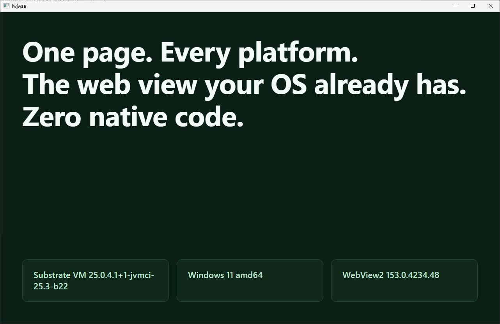

<h1 align="center">lwjwae</h1>

<p align="center">
  <b>Lightweight Java web application engine</b><br/>
  <i>No JNI. No native code. No native artifacts.</i>
</p>

<p align="center">
  <a href="https://github.com/fakeivchenko/lwjwae/actions/workflows/tests.yml"></a>
  <a href="https://github.com/fakeivchenko/lwjwae/actions/workflows/release.yml"></a>
  <a href="https://repo.ivchenko.dev/#/releases/dev/ivchenko/lwjwae/lwjwae-core"></a>
  
  
  <a href="LICENSE"></a>
</p>

Native desktop applications with a web view inside, from Java, through the Foreign Function and Memory
API. No JNI, no native artifacts of the library's own: on each platform, the window and the engine
are the ones that the operating system already has.

| Platform | Window | Engine        | Module                             | JAR                 | Native Image        |
|----------|--------|---------------|------------------------------------|---------------------|---------------------|
| Linux    | GTK 3  | WebKitGTK 4.1 | [`lwjwae-gtk`](lwjwae-gtk)         | <center>✅</center> | <center>✅</center> |
| Linux    | GTK 4  | WebKitGTK 6.0 | [`lwjwae-gtk4`](lwjwae-gtk4)       | <center>✅</center> | <center>✅</center> |
| Windows  | Win32  | WebView2      | [`lwjwae-windows`](lwjwae-windows) | <center>✅</center> | <center>✅</center> |
| macOS    | Cocoa  | WKWebView     | [`lwjwae-macos`](lwjwae-macos)     | <center>✅</center> | <center>✅</center> |

You write the interface in HTML, CSS, and JavaScript, ship it inside the native executable or JAR-package,
and call Java from the page and the page from Java through one bridge that works the same on every engine.



The window above is native compiled application created using lwjwae, compiled with
GraalVM to one executable and captured on Windows 11.

## Get started

One line opens a window on a page of the application and returns when it closes:

```java
Application.launch("Notes", "app/index.html");
```

The [wiki](https://github.com/fakeivchenko/lwjwae/wiki) walks you through a whole application, step by step:

1. [Set up the project](https://github.com/fakeivchenko/lwjwae/wiki/1.-Set-up-the-project): what each platform needs, and the Gradle build.
1. [Open a window](https://github.com/fakeivchenko/lwjwae/wiki/2.-Open-a-window) on a page of the application.
1. [Call Java from the page](https://github.com/fakeivchenko/lwjwae/wiki/3.-Call-Java-from-the-page), and
   [send events from Java to the page](https://github.com/fakeivchenko/lwjwae/wiki/4.-Send-events-from-Java-to-the-page).
1. [Draw your own title bar](https://github.com/fakeivchenko/lwjwae/wiki/5.-Draw-your-own-title-bar).
1. [Export notes through a native dialog](https://github.com/fakeivchenko/lwjwae/wiki/6.-Export-notes-through-a-native-dialog), and
   [keep the application in the tray](https://github.com/fakeivchenko/lwjwae/wiki/7.-Keep-the-application-in-the-tray).
1. [Package the application](https://github.com/fakeivchenko/lwjwae/wiki/8.-Package-the-application), as a native executable too.

In short: Java 25 or later, run with `--enable-native-access=ALL-UNNAMED`, and the web engine of
the platform, which Windows 11 and macOS already have; [`lwjwae-gtk`](lwjwae-gtk#requirements) lists
the packages of each Linux distribution. The modules are in
`https://repo.ivchenko.dev/releases` under the group `dev.ivchenko.lwjwae`: `lwjwae-core` for your
code, and at runtime the backend of each platform that you ship for. On Linux without WebKitGTK
4.1, [`lwjwae-gtk4`](lwjwae-gtk4#requirements) runs on WebKitGTK 6.0 instead. Typed bindings and
events need a codec from [lwjwae-codecs](https://github.com/fakeivchenko/lwjwae-codecs).

## What you get

- **Short when it can be, detailed when it must.** `Application.launch("Docs", "app/index.html")`
  is a whole application; `window.alert`, `confirm`, `pickFile`, `application.tray(icon, items)`,
  and `showNotification(title, body)` state the common choice. Under them is the detailed API
  with every option.
- **One API for three engines.** Title, size, resizing, navigation, inline HTML, script evaluation,
  load events, the developer tools. Every method works from any thread; the backend forwards it to
  the UI thread of the toolkit.
- **As many windows as you need.** An `Application` owns the UI thread, the codec, and the list of
  windows; `open` adds a `Window`, `run` blocks while any is open, `quit` closes them all. A page
  opens and closes windows too, through `window.lwjwae.open(options)` and `window.lwjwae.close()`.
- **A bridge in both directions, at two levels.** `bind` exposes a Java function to the page as
  `window.NAME(payload)`, which returns a promise. `emit` delivers an event to the page. On a window,
  they belong to that window; on the application, a binding reaches every window and learns which
  one called, a listener hears every window, and `emit` reaches every page. Handlers run on virtual
  threads, so a slow one doesn't freeze the window. The core has no serialization dependency; a
  codec adds typed calls with records and objects. Pages of other origins can't call Java.
- **Calls with bytes and streams.** `handle` answers `lwjwae.call(name, body)` on the page with a
  `Response`: text, bytes, a value through the codec, or a stream that the page reads while Java
  writes it, several hundred MB/s. An `AbortSignal` reaches the handler. Only the pages of the
  application, and the development server, may call.
- **Windows under control.** Minimize, maximize, full screen, on top, focus, size limits, and events
  for every change of a window in Java and on the page. With a state key, a window opens the way it
  last closed.
- **Clipboard.** `application.clipboard()` reads and writes text and images, as PNG, on the desktop
  clipboard from Java, and `lwjwae.clipboard` reads and writes text on the page, without the
  prompts of `navigator.clipboard`.
- **Global shortcuts.** `application.globalShortcut("CmdOrCtrl+Shift+Space", window::focus)` runs a
  handler on a shortcut, whichever application has the keyboard: `RegisterHotKey` on Windows, a
  hot key of Carbon on macOS, a key grab on X11, and the `GlobalShortcuts` portal on Wayland.
- **Screens.** `application.screens()` and `window.screen()` tell where the screens are, their work
  areas and scales; a window that remembers its place doesn't open on a monitor that is gone.
- **Native dialogs.** `showOpenDialog`, `showSaveDialog`, and `showMessageDialog` on a window, and
  `lwjwae.dialog` on the page: files and folders to open, a file to save, and a message, as the
  platform draws them, through the portal of the desktop inside a Linux sandbox.
- **Links go to the browser.** A link to another site, `target="_blank"`, and `window.open` open in
  the browser of the system rather than in the window, or wherever `externalLinkHandler` says;
  `Application.openExternal(url)` does the same from Java.
- **Your own title bar.** `decorated(false)` takes the title bar away and keeps the shadow and the
  resize edges; `data-lwjwae-drag` on the page's own bar moves the window, and
  `lwjwae.window.minimize()` and the like work its buttons. `closable`, `minimizable`, and
  `maximizable` take a button off a native title bar.
- **Transparent windows.** `transparent(true)` lets the desktop show through wherever the page
  draws nothing, for a widget of any shape with a page of rounded, half-transparent cards.
- **A tray icon, and windows that hide.** `Application.tray(TrayIcon)` puts an icon with a menu in
  the notification area on Windows, the menu bar on macOS, or the StatusNotifier or XEmbed tray on
  Linux. With `CloseAction.HIDE`, the close button hides a window instead of closing it while a tray
  icon is up to bring it back, and `run` keeps going while a tray icon is up, so an application can
  live in the tray.
- **Notifications.** `Application.showNotification(Notification)` shows a desktop notification with
  a title, a body, an image, and buttons, and runs a handler on a click: a toast on Windows,
  `UNUserNotificationCenter` on macOS for an `.app` bundle, and the `org.freedesktop.Notifications`
  service on Linux.
- **One instance.** `Application.createSingleInstance(parameters, args)` lets a second start hand
  its arguments to the running process, whose window comes to the front, and end, having opened
  nothing; `onSecondInstance` hears of it.
- **Pages from the classpath.** `loadResource("app/index.html")` serves the files of the
  application under a custom scheme, so relative links, stylesheets, scripts, and `fetch` resolve
  as on a web server. During development, `LWJWAE_DEV_SERVER_URL` points every window at a Vite
  or webpack server with hot reload instead.
- **Native image ready.** Every FFM stub is recorded, and each backend ships the reachability
  metadata that `native-image` needs. A test keeps the metadata in step with the bindings.

## Modules

| Module                             | Contents                                                                                                    |
|------------------------------------|-------------------------------------------------------------------------------------------------------------|
| [`lwjwae-core`](lwjwae-core)       | The API, the bridge, backend discovery, FFM helpers, and the contract tests that every backend runs.        |
| [`lwjwae-glib`](lwjwae-glib)       | What the two Linux backends share: GLib, GIO and D-Bus bindings, the GLib UI thread, notifications, a tray. |
| [`lwjwae-gtk`](lwjwae-gtk)         | The Linux backend.                                                                                          |
| [`lwjwae-gtk4`](lwjwae-gtk4)       | The Linux backend on GTK 4 and WebKitGTK 6.0. Serves its tray over D-Bus itself; can't place windows.       |
| [`lwjwae-windows`](lwjwae-windows) | The Windows backend. Finds the WebView2 runtime without `WebView2Loader.dll` and talks COM through vtables. |
| [`lwjwae-macos`](lwjwae-macos)     | The macOS backend. Drives Cocoa through the Objective-C runtime.                                            |

Each module has a README that walks through what happens on its platform: the UI thread, window
creation, callbacks, resources, script evaluation, and closing.

Two sibling repositories complete the picture:

- [lwjwae-codecs](https://github.com/fakeivchenko/lwjwae-codecs): the codec modules for the typed bridge.
- [lwjwae-examples](https://github.com/fakeivchenko/lwjwae-examples): runnable applications, starting with the demo.

## Design in short

- **One UI thread per process.** A `UiDispatcher` owns the thread that the toolkit accepts and
  forwards work to it. GTK and Win32 get a thread of their own; Cocoa gets the main thread, which
  the library doesn't own and therefore only borrows. Applications and windows share it.
- **An application is the process, a window is a window.** `Application` holds what exists once:
  the dispatcher, the codec, the WebView2 environment, the window list. `Window` holds one native
  window and its web view. Closing the last window ends `run()`; it doesn't end the application.
- **Static callbacks, keyed by ID.** A C callback carries no closure, only a `void*`. Objects are
  registered under generated IDs that travel as that pointer, so one upcall stub serves every
  window and the set of stubs stays fixed for `native-image`.
- **Nothing unwinds into C.** Every callback catches `Throwable` and reports it. A Java exception
  crossing into a toolkit is undefined behavior.
- **The bridge is one protocol, RPC.** A binding, an event from the page, and a window that the
  page opens are calls; the events of Java travel in the answer of one call that the page keeps
  open. Small calls take the message channel of the engine, `lwjwae.call` the transport that
  streams best. Only a document of the application's origin, or of the development server, may
  call.
- **A codec brings both halves.** The Java half encodes and decodes objects; the page half is a
  JavaScript object that the codec ships and the bridge runtime evaluates in every document.

## Build and test

```bash
./gradlew check            # Style checks, unit tests, and the display tests of every backend
./gradlew test             # Headless only
./gradlew displayTest      # Opens real windows; skips without a display
./gradlew networkTest      # Loads a public site; never part of a default run
./gradlew spotlessApply    # Formats every Java file
```

The display tests skip when no display is present, so a headless machine gets a passing build. CI
runs them under Xvfb with openbox as the window manager, through
`scripts/linux/with-window-manager.sh`, and with `-Dlwjwae.requireDisplay=true`, which turns a
missing display into a failure. `scripts/linux/test-in-docker.sh` runs the same environment
locally. The Windows backend compiles and runs its headless tests anywhere; `scripts/windows` drives
a Windows VM over SSH for the rest.

The code follows Google Java Style with a few additions; [docs/CODE_STYLE.md](docs/CODE_STYLE.md)
lists every rule, the tool that enforces it, and the workflow.

`scripts/linux/test-in-docker.sh` runs Gradle in the environment of the Linux CI job, from
`Dockerfile.test`: Ubuntu 24.04 with GTK 3 and 4, a virtual X display, a private session bus with a
notification server, and software rendering. Without arguments it runs every display test, with
screenshots; the reports come back to `build/docker/`:

```bash
scripts/linux/test-in-docker.sh
scripts/linux/test-in-docker.sh check
scripts/linux/test-in-docker.sh :lwjwae-gtk4:displayTest --tests '*Bridge*'
```

## CI and releases

Two workflows, two branches:

- `tests.yml` runs on every push to `dev`: the style checks first, then the headless and display
  tests on Linux (x86_64 and arm64), Windows, and macOS (x86_64 and arm64), with the screenshots of every window as
  artifacts.
- `release.yml` runs on every push to `release`: the same tests, then a version from the commit
  messages, `publish` to the Maven repository with that version, and a tag and a GitHub release.

Nothing runs for any other branch or for a pull request.

## License

Apache License 2.0. See [LICENSE](LICENSE).
